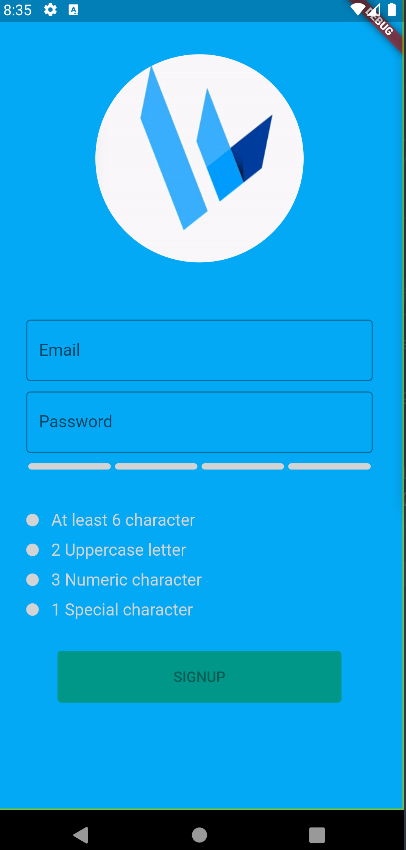

# signup_dev

The registration screen that activate the "registration" button when form success

## Getting Started

You can follow Password validation for reference
- https://dev.mysql.com/doc/refman/5.6/en/validate-password-options-variables.html



### Depencencies
- `flutter_pw_validator: ^1.5.0`

### Android Permission

This permission used for `NetworkImage('https://i.stack.imgur.com/vXYLh.gif')`

```xml
<uses-permission android:name="android.permission.INTERNET" />
<uses-permission android:name="android.permission.ACCESS_NETWORK_STATE" />
```

## Flutter help
For help getting started with Flutter development, view the
[online documentation](https://docs.flutter.dev/), which offers tutorials,
samples, guidance on mobile development, and a full API reference.
